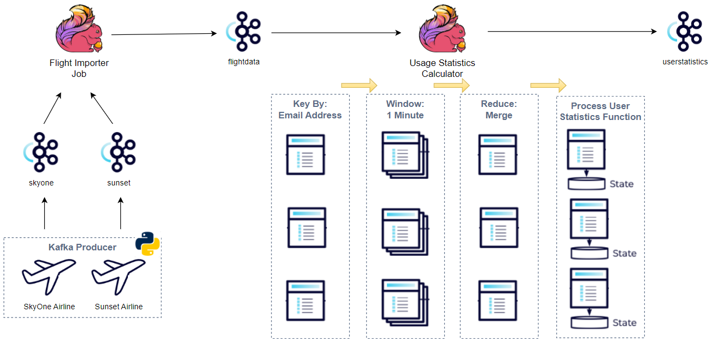

# Apache-Flink-Tutorial-01

# Building Pyflink Apps - Apache Flink with Python

Used a Kafka producer instead to create topics and send messages.
    - 4 topics are created (_skyone_, _sunset_, _flightdata_ and _userstatistics_) and messages are sent to the first two topics.
    - Topics are created by a flag argument so add it if it is the first time running it. Basically it deletes the topics if exits and creates them.

✅ Creating a Flink Data Source
   - It reads from the _skyone_ topic and prints the values. The values are deserialized as string.
   - This and all the other Pyflink applications can be executed locally or run in the Flink cluster.
   
✅ Deserializing Messages in Flink
    - The _skyone_ message values are deserialized as Json string and they are returned as the [named Row type](https://nightlies.apache.org/flink/flink-docs-master/api/python/reference/pyflink.common/api/pyflink.common.typeinfo.Types.ROW_NAMED.html#pyflink.common.typeinfo.Types.ROW_NAMED). As the Flink type is not convenient for processing, it is converted into a Python object, specifically [Data Classes](https://docs.python.org/3/library/dataclasses.html).

✅ Flink Data Transformations
    - The source data is transformed into the flight data. Later data from _skyone_ and _sunset_ will be converted into this schema for merging them.
    - The transformation is performed in a function called _define_workflow_ for being tested. This function will be updated gradually.

✅ Creating a Flink Data Sink
    - The converted data from _skyone_ will be pushed into a Kafka topic (_flightdata_).

✅ Merging Flink Data Streams
    - Records from the _skyone_ and _sunset_ topics are merged and sent into the _flightdata_ topic after being converted into the flight data.

✅ Aggregating Flink Data using Windowing
    - Usage statistics (total flight duration and number of flights) are calculated by email address, and they are sent into the _userstatistics_ topic.

✅ Managing State in Flink 
    - The transformation gets _stateful_ so that usage statistics are continuously updated by accessing the state values.
    - The _reduce_ function includes a window function that allows you to access the global state. The window function takes the responsibility to keep updating the global state and to return updated values.

## Start Applications

# Start the ZooKeeper service
$ bin/zookeeper-server-start.sh config/zookeeper.properties

# Start the Kafka broker service
$ bin/kafka-server-start.sh config/server.properties

# Start/Stop Flink Cluster
$ ./bin/start-cluster.sh
$ ./bin/stop-cluster.sh

# set flink path
$ export PATH=/home/vjtaisunubuntu/Downloads/flink-1.18.1/bin:$PATH

#### start kafka producer in one terminal
python data_gen.py

#### submit pyflink apps in another terminal
# run flink job
flink run -p 1 -py /home/vjtaisunubuntu/Desktop/DemoProject/flight-data-sink/create_source.py -pyfs /home/vjtaisunubuntu/Desktop/DemoProject/flight-data-sink/utils.py,/home/vjtaisunubuntu/Desktop/DemoProject/flight-data-sink/models.py -pyreq /home/vjtaisunubuntu/Desktop/DemoProject/flight-data-sink/requirements.txt -pyclientexec /home/vjtaisunubuntu/Desktop/DemoProject/flight-data-sink/env/bin/python -pyexec /home/vjtaisunubuntu/Desktop/DemoProject/flight-data-sink/env/bin/python

# Creating python virtual enviroment zip
# use script setup-pyflink-virtual-env.sh
$ setup-pyflink-virtual-env.sh 1.10.2